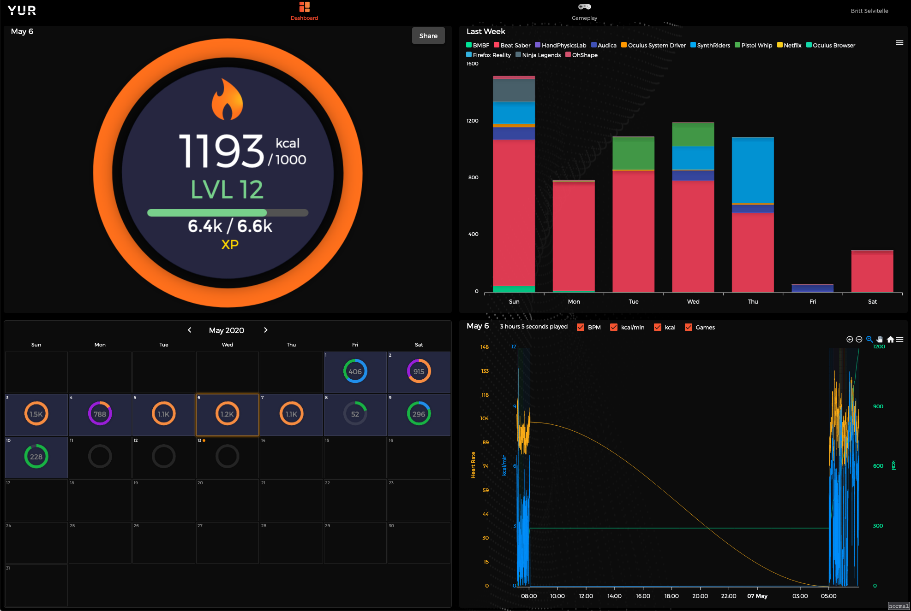
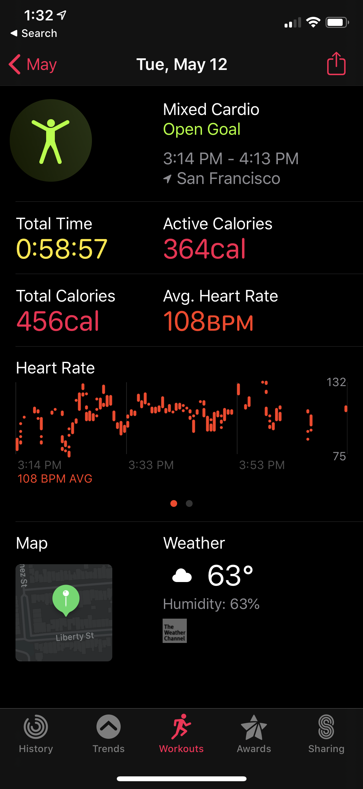

> BTW I wanted to check in on your Oculus usage since we last chatted… do you feel like it’s part of your regular routine now? Oh and side-question— have you tried watching 2D media on it at all? I’m still super curious about it as an “isolated viewing” platform for when flights start up again…

Brew! This is actually a great prompt to reflect on my usage.

## Usage patterns

I use it every day. The Quest doesn't expose usage stats overall, but I'm using this sideloaded app to track my fitness. For some reason it hasn't tracked the last few days (it's still beta), but on average I'm burning from 400-800 calories a day.

Interesting to your question is how is my time being spent with it and how do I feel?

At first it was like any shiny new thing ... new and shiny! I was spending a disproportionate amount of time between 'just using' and 'playing with.' Lots of time was on setup, optimization, and just playing with the 'tool.' Although it's important to note that that ended in me actually *playing* games for hours on end, which never happened with the Vive. While the Vive was purely a technical experience for me, the Quest has been that PLUS play. So I would spend 1-2 hours on technical play and then 1-2 hours on gameplay/fitness.

Now that it's becoming more normal the curve is shifting dramatically, starting yesterday in fact. I had an hour break between meetings and I wanted to move my body, so I popped on the Quest and banged out 40min or so of Beat Saber. (Side note: I really really can't express how much it gets my heart going to Beat Saber Rage Against the Machine)

No downloading new songs, no tweaking this setting or that. Just play.

Here's what my watch recorded:

## Going forward

Right now I plan to use it just about ever day for some light movement. In particular, I'm really enjoying:

* Beat Saber + Custom Songs
* Synth Rider
* Pistol Whip
* Audica (less of a workout and more chill)

Apps I'm curious if I will get into:

* Multiplayer in general
* That tron like multiplayer disc game. I really like the idea of it but as usual I'm not psyched to jump in with a team of mic using teenagers yelling at me about my play. I just want to have fun. It's these sorts of games that make me wish I had more friends on the platform.
* The fricking amazing future racquetball which was so fun but I haven't played it again for some reason that needs some investigating.

## Would I recommend it?

It's hard to say still. I'm the type of person that gets really excited about something and then it goes away completely after some period of time. There are actually *very* few things that keep my attention for a long period of time. I'm very much a master of none type of human.

I think an interesting question for me and this is: "Was it worth the cost, contextualized with my budget?" For me, it's an absolute yes. The ability to pick it up and play whenever I want combined with the fitness aspect has been, for me, already worth the investment, even if I drop it in 2 weeks.

By the way, it's really hard to overstate the portability. I would NOT be using this as much if I were tethered to a room or set of base-stations. I've even been taking it on the couch and watching Netflix. It's actually quite amazing to watch a TV show on a virtual theater screen, even if the resolution is reduced. 

So unfortunately it's a bit difficult to give a recommendation for you. Will I be playing it in a month? I _think_ so, but not sure. There's definitely a world where I'm not. Is it worth it if it isn't a huge hit to your income/budgeting plans? Absolutely. No question.

So there are my thoughts brew! Wow! This was longer than I expected it to be! But I'm really enjoying writing these things up with a bit more nuance.
